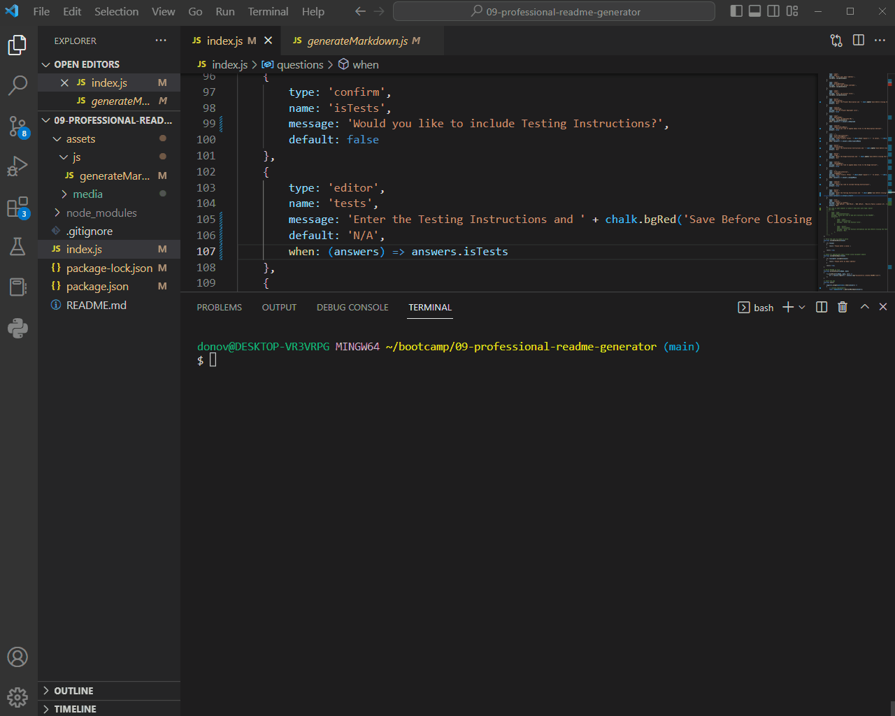

# README Generator

  
## Table of Contents

* [Description](#description)
* [Installation](#installation)
* [Usage](#usage)
* [Contribution](#contribution)
* [Testing](#testing)
* [Questions](#questions)
* [Licensing](#licensing)

## Description

Public GitHub projects are how developers showcase their work, collaborate with other developers, and share their knowledge with the world. An essential component of these projects is the README file.

Creating a README file is not a daunting task but writing content and structuring the markdown takes time that could be better spent on projects. This README generator saves you the effort of formatting and structuring the markdown - Simply answer a series of questions and let the generator handle the heavy lifting.

## Installation

Before attempting to run the generator you will have to do a little prep work. To start you will need to install Node.js, initialize, and then install the following modules (npm install 'module'):

- inquirer
- inquirer-file-tree-selection-prompt
- chalk
- email-validator
- dedent-js

## Usage

To start open your preferred cmd prompt or terminal and navigate to the root directory of the generator.

Enter the command **node index.js** and witness the magic.

You will be prompted with a series of questions and instructions.

For questions requiring longer text input your default text editor will spawn. Make your entry into the text editor, **SAVE**, and then close the window.

Once the generator is done it will build your README file and save it in the project's root directory as ‘generatedREADME.md’.

 
  

        
  

 

## Contribution

Follow the "fork-and-pull" Git workflow.

  1. **Fork** the repo on GitHub
  2. **Clone** the project to your own machine
  3. **Commit** changes to your own branch
  4. **Push** your work back up to your fork
  5. Submit a **Pull request** so that we can review your changes

NOTE: Be sure to merge the latest from "upstream" before making a pull request!

## Testing

N/A

## Questions

Feel free to contact me with any questions or comments:  
<donovan.courtney@gmail.com>  
<https://github.com/decourtney>

## Licensing

Code and Docs released under [MIT License](https://choosealicense.com/licenses/mit/).
